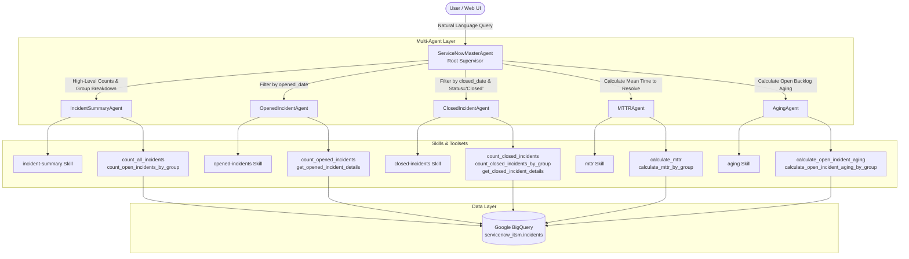

# ServiceNow Incident Analytics Agent

[](https://www.python.org/)
[](https://google.github.io/adk-docs/)
[](https://ai.google.dev/gemini-api/docs)
[](https://cloud.google.com/bigquery)
[](https://cloud.google.com/run)
[](LICENSE)

An AI-powered incident analytics assistant built with **Google Agent Development Kit (ADK)**, **Gemini**, and **BigQuery**. It answers natural-language questions about incident counts, aging, resolution times, status breakdowns, and assignment-group analysis using a modular **multi-agent supervisor architecture** with specialized sub-agents and ADK skills.

> **Note:** This is a learning and demonstration project. Use synthetic or approved data, and review security, access controls, logging, and cost controls before using real production incident data.

---

## Table of Contents

- [Motivation](#motivation)
- [Key Features](#key-features)
- [Example Questions](#example-questions)
- [Architecture Overview](#architecture-overview)
  - [Components](#components)
  - [Multi-Agent Orchestration Flow](#multi-agent-orchestration-flow)
- [Agent & Sub-Agent Deep Dive](#agent--sub-agent-deep-dive)
  - [1. ServiceNowMasterAgent (Supervisor Root Agent)](#1-servicenowmasteragent-supervisor-root-agent)
  - [2. IncidentSummaryAgent (High-Level Summary Specialist)](#2-incidentsummaryagent-high-level-summary-specialist)
  - [3. OpenedIncidentAgent (Opened Ticket Specialist)](#3-openedincidentagent-opened-ticket-specialist)
  - [4. ClosedIncidentAgent (Closed Ticket Specialist)](#4-closedincidentagent-closed-ticket-specialist)
  - [5. MTTRAgent (Resolution Time Specialist)](#5-mttragent-resolution-time-specialist)
  - [6. AgingAgent (Open Ticket Aging Specialist)](#6-agingagent-open-ticket-aging-specialist)
- [Skills System & Toolsets](#skills-system--toolsets)
- [Codebase Walkthrough & Detailed Code Explanations](#codebase-walkthrough--detailed-code-explanations)
  - [1. Synthetic Data Generator (`scripts/generate_servicenow_data.py`)](#1-synthetic-data-generator-scriptsgenerate_servicenow_datapy)
  - [2. Root Supervisor Agent (`servicenow_agent_app/agent.py`)](#2-root-supervisor-agent-servicenow_agent_appagentpy)
  - [3. Sub-Agent Construction & Tool Binding Pattern](#3-sub-agent-construction--tool-binding-pattern)
  - [4. Detailed Sub-Agent Tool Implementations](#4-detailed-sub-agent-tool-implementations)
    - [A. Incident Summary Tools (`incident_summary_tools.py`)](#a-incident-summary-tools-incident_summary_toolspy)
    - [B. Opened Incident Tools (`opened_incident_tools.py`)](#b-opened-incident-tools-opened_incident_toolspy)
    - [C. Closed Incident Tools (`closed_incident_tools.py`)](#c-closed-incident-tools-closed_incident_toolspy)
    - [D. MTTR Calculation Tools (`mttr_tools.py`)](#d-mttr-calculation-tools-mttr_toolspy)
    - [E. Open Incident Aging Tools (`aging_tools.py`)](#e-open-incident-aging-tools-aging_toolspy)
  - [5. Parameterized SQL & Anti-Injection Architecture](#5-parameterized-sql--anti-injection-architecture)
- [Data Model & Schema](#data-model)
- [Technology Stack](#technology-stack)
- [Libraries and Frameworks Used](#libraries-and-frameworks-used)
- [Repository Structure](#repository-structure)
- [Prerequisites](#prerequisites)
- [Configuration](#configuration)
- [Local Setup & Step-by-Step Guide](#local-setup)
- [Cloud Infrastructure Setup](#cloud-infrastructure-setup)
  - [1. Google Cloud Project & APIs](#1-google-cloud-project--apis)
  - [2. BigQuery Dataset & Table Creation](#2-bigquery-dataset--table-creation)
  - [3. Ingesting Synthetic Incident Data](#3-ingesting-synthetic-incident-data)
- [BigQuery Access & IAM](#bigquery-access)
- [Deploy to Cloud Run](#deploy-to-cloud-run)
- [Evaluation & Testing Framework](#evaluation--testing-framework)
- [Example Analytics](#example-analytics)
- [Security and Cost Considerations](#security-and-cost-considerations)
- [Troubleshooting](#troubleshooting)
- [Learning Outcomes](#learning-outcomes)
- [Future Enhancements](#future-enhancements)
- [Disclaimer](#disclaimer)

---

## Motivation

Managing and analyzing IT Service Management (ITSM) data in modern enterprises often requires complex SQL queries, manual dashboard configurations, and constant back-and-forth between IT operations managers and business intelligence teams. 

This project explores **Agentic DataOps** using Google's modern AI ecosystem. By combining the **Google Agent Development Kit (ADK)**, the speed and reasoning of **Gemini 3.5 Flash Lite**, and the analytical horsepower of **Google BigQuery**, this solution enables stakeholders to query enterprise incident telemetry conversationally—handling time filters, group categorizations, Mean Time to Resolve (MTTR), and backlog aging without writing a single line of SQL.

---

## Key Features

- Natural-language questions over BigQuery incident data
- Open and closed incident counts
- Filtering by date range and assignment group when requested
- Mean time to resolve for closed incidents
- Average aging for open incidents
- Assignment-group analysis
- Google ADK agent architecture
- Cloud Run deployment
- Configuration through environment variables
- Separate development and production deployments
- Hierarchical multi-agent supervisor pattern for clean separation of concerns
- Decoupled ADK skills and deterministic parameterized BigQuery tools to prevent SQL injection
- Built-in evaluation test suites (`evalset`) for automated agent benchmark testing

---

## Example Questions

- How many open incidents are there?
- How many incidents were closed in August 2026?
- What is the mean time to resolve for closed incidents?
- What is the average age of open incidents?
- Show open incidents by assignment group.
- Count incidents for the Cloud Infrastructure assignment group.
- Show incident details for a specific month.
- What is MTTR for Cyber Security in August 2026?
- Give me closed incident counts by assignment group.
- List the tickets opened for Network Support.

The exact questions supported depend on the tools and instructions configured in the agent.

---

## Architecture Overview


### Components

1. **Agent layer**
   - Google Agent Development Kit (ADK)
   - Gemini model for interpreting questions and composing responses
   - Agent instructions, tools, and optional sub-agents or skills
   - Supervisor pattern routing user intent to domain-specific specialist agents

2. **Data layer**
   - BigQuery stores incident records in `servicenow_itsm.incidents`
   - Safe, parameterized SQL queries aggregate and filter incident data without SQL injection risks

3. **Deployment layer**
   - Cloud Run hosts the deployed ADK application as a serverless container
   - Google Cloud IAM controls access to cloud resources with least-privilege service accounts

### Multi-Agent Orchestration Flow

The architecture follows a hierarchical multi-agent structure. The root supervisor agent (`ServiceNowMasterAgent`) intercepts user queries, validates parameters (such as time boundaries and assignment groups), disambiguates user intent through conversational follow-ups, and delegates execution exclusively to domain-specific specialist agents:



#### Multi-Agent Execution Lifecycle:
1. **Query Ingestion**: User submits a natural-language query via the interface.
2. **Supervisor Disambiguation & Parameter Validation**: `ServiceNowMasterAgent` inspects intent, extracts dimensions (e.g., month/year, target assignment group), and triggers conversational follow-up if ambiguous (e.g., prompt for year if only month was given).
3. **Targeted Sub-Agent Delegation**: The supervisor routes execution context directly to the appropriate specialist agent.
4. **Skill Guidance & Tool Invocation**: The specialist sub-agent evaluates rules from its `SKILL.md` and triggers the corresponding parameterized BigQuery tool.
5. **Secure BigQuery Analytics**: The tool executes a type-safe SQL query via `QueryJobConfig` and converts raw BigQuery rows into a structured dictionary.
6. **LLM Synthesis**: Gemini formulates a concise, natural-language response for the user with calculated metrics and context.


---

## Agent & Sub-Agent Deep Dive

### 1. ServiceNowMasterAgent (Supervisor Root Agent)
- **File**: `servicenow_agent_app/agent.py`
- **Model**: `gemini-3.5-flash-lite`
- **Role**: Lead Orchestrator and Dispatcher.
- **Key Responsibilities**:
  - Validates user input and extracts analytical dimensions (time periods and assignment groups).
  - Handles conversational follow-ups (e.g., if a user mentions "August" without a year, it asks for the year; if the user says "everything", it interprets it as all historical data).
  - Strictly distinguishes between **Opened Incidents** (incidents created in a date range) vs. **Currently Open Incidents** (backlog with status `New`, `In Progress`, or `On Hold`).
  - Delegates requests to one of the five specialist sub-agents without generating ad-hoc SQL directly.

### 2. IncidentSummaryAgent (High-Level Summary Specialist)
- **Directory**: `servicenow_agent_app/sub_agents/incident_summary/`
- **Skill**: `incident-summary`
- **Tools**:
  - `count_all_incidents`: Counts all rows across the table regardless of date or status.
  - `count_open_incidents_by_group`: Aggregates currently open incidents (`New`, `In Progress`, `On Hold`) grouped by assignment group.
- **Behavior**: Returns pure count metrics without returning verbose ticket records.

### 3. OpenedIncidentAgent (Opened Ticket Specialist)
- **Directory**: `servicenow_agent_app/sub_agents/opened_incidents/`
- **Skill**: `opened-incidents`
- **Tools**:
  - `count_opened_incidents`: Returns the number of tickets opened in a given month/year or all-time, optionally filtered by assignment group.
  - `get_opened_incident_details`: Retrieves specific incident rows (ID, dates, status, assignee, priority, description) when the user explicitly requests tickets, IDs, or details.
- **Behavior**: Enforces the "Count by Default, Details on Explicit Demand" policy to keep responses concise.

### 4. ClosedIncidentAgent (Closed Ticket Specialist)
- **Directory**: `servicenow_agent_app/sub_agents/closed_incidents/`
- **Skill**: `closed-incidents`
- **Tools**:
  - `count_closed_incidents`: Counts closed incidents (`status = 'Closed'`) within a target time period and/or assignment group.
  - `count_closed_incidents_by_group`: Returns a breakdown of closed incident counts for each assignment group.
  - `get_closed_incident_details`: Fetches closed ticket records sorted by `closed_date DESC`.
- **Behavior**: Uses `closed_date` for monthly time filtering.

### 5. MTTRAgent (Resolution Time Specialist)
- **Directory**: `servicenow_agent_app/sub_agents/mttr/`
- **Skill**: `mttr`
- **Tools**:
  - `calculate_mttr`: Computes overall Mean Time To Resolve across closed incidents using BigQuery `TIMESTAMP_DIFF(closed_date, opened_date, SECOND)`. Returns MTTR in hours and days along with the sample count.
  - `calculate_mttr_by_group`: Calculates average MTTR individually for every assignment group.
- **Behavior**: Excludes open tickets and ensures data hygiene (both `opened_date` and `closed_date` must be non-null).

### 6. AgingAgent (Open Ticket Aging Specialist)
- **Directory**: `servicenow_agent_app/sub_agents/aging/`
- **Skill**: `aging`
- **Tools**:
  - `calculate_open_incident_aging`: Measures elapsed backlog age for currently open tickets using `TIMESTAMP_DIFF(CURRENT_TIMESTAMP(), opened_date, SECOND)`. Returns average aging in days.
  - `calculate_open_incident_aging_by_group`: Measures open ticket aging broken down by assignment group.
- **Behavior**: Only targets active ticket statuses (`New`, `In Progress`, `On Hold`) and excludes closed records.

---

## Skills System & Toolsets

The agent uses the **Google ADK Skills** module (`google.adk.skills.load_skill_from_dir` and `google.adk.tools.skill_toolset.SkillToolset`). Each sub-agent directory contains a dedicated `skills/` folder containing a standard `SKILL.md` specification:

| Sub-Agent | Skill Name | Skill File | Core Responsibility |
|---|---|---|---|
| `IncidentSummaryAgent` | `incident-summary` | `sub_agents/incident_summary/skills/incident-summary/SKILL.md` | Table-wide counts & open backlog by group |
| `OpenedIncidentAgent` | `opened-incidents` | `sub_agents/opened_incidents/skills/opened-incidents/SKILL.md` | Creation-date filtering & ticket extraction |
| `ClosedIncidentAgent` | `closed-incidents` | `sub_agents/closed_incidents/skills/closed-incidents/SKILL.md` | Resolution-date filtering, counts & group metrics |
| `MTTRAgent` | `mttr` | `sub_agents/mttr/skills/mttr/SKILL.md` | Precise timestamp difference & resolution averages |
| `AgingAgent` | `aging` | `sub_agents/aging/skills/aging/SKILL.md` | Real-time open ticket age calculations |

---

## Codebase Walkthrough & Detailed Code Explanations

### 1. Synthetic Data Generator (`scripts/generate_servicenow_data.py`)
This script generates a realistic synthetic ITSM dataset of 10,000 incident tickets and loads it directly into Google BigQuery:

```python
import random
from datetime import datetime, timedelta
import pandas as pd
from google.cloud import bigquery

# Project Configuration
PROJECT_ID = "YOUR_PROJECT_ID"
DATASET_ID = "servicenow_itsm"
TABLE_ID = "incidents"

ASSIGNMENT_GROUPS = [
    "Database Admin", "Network Support", "Service Desk", 
    "Cloud Infrastructure", "Cyber Security", "Application Dev"
]

ASSIGNEES = {
    "Database Admin": ["Alice M.", "Bob K."],
    "Network Support": ["Charlie D.", "Diana P."],
    "Service Desk": ["Evan R.", "Fiona L."],
    "Cloud Infrastructure": ["George B.", "Hannah T."],
    "Cyber Security": ["Ian W.", "Julia S."],
    "Application Dev": ["Kevin V.", "Laura C."]
}

CATEGORIES = ["Hardware", "Software", "Network", "Database", "Security"]
PRIORITIES = ["1 - Critical", "2 - High", "3 - Moderate", "4 - Low"]
```

#### Key Logic in Data Generation:
- **Date Window Distribution**: Generates tickets with `opened_date` uniformly distributed across the past 180 days (`timedelta(days=180)`).
- **80/20 Lifecycle Distribution**:
  ```python
  is_closed = random.random() < 0.80
  if is_closed:
      status = "Closed"
      # Resolution time modeled with exponential distribution (mean ~36 hours)
      resolution_hours = random.expovariate(scale=36)
      closed_at = opened_at + timedelta(hours=max(0.25, resolution_hours))
      if closed_at > end_date:
          closed_at = end_date
  else:
      status = random.choice(["New", "In Progress", "On Hold"])
      closed_at = None
  ```
- **Automated BigQuery Ingestion**: Creates dataset if missing and uses `bigquery.LoadJobConfig(write_disposition="WRITE_TRUNCATE")` for clean data reloads.

---

### 2. Root Supervisor Agent (`servicenow_agent_app/agent.py`)
Defines the `root_agent` (`ServiceNowMasterAgent`) using the Google ADK:

```python
from google.adk import Agent
from .sub_agents.incident_summary.agent import incident_summary_agent
from .sub_agents.opened_incidents.agent import opened_incidents_agent
from .sub_agents.closed_incidents.agent import closed_incidents_agent
from .sub_agents.mttr.agent import mttr_agent
from .sub_agents.aging.agent import aging_agent

root_agent = Agent(
    name="ServiceNowMasterAgent",
    model="gemini-3.5-flash-lite",
    description="Lead ServiceNow incident analytics agent...",
    instruction="""...Routing rules, entity validation, and delegation instructions...""",
    sub_agents=[
        incident_summary_agent,
        opened_incidents_agent,
        closed_incidents_agent,
        mttr_agent,
        aging_agent,
    ],
)
```

#### Supervisor Design Principles:
1. **Zero Ad-Hoc SQL at Root**: Root agent never creates SQL statements directly; it delegates execution to specialized sub-agents.
2. **Entity Validation & Disambiguation**: Checks if user provided a month without a year (asks for year), handles keywords like "all" or "everything", and maps requested teams to valid assignment groups.
3. **Strict Sub-Agent Routing**:
   - `OpenedIncidentAgent`: For questions on tickets opened in a specific period (`opened_date`).
   - `ClosedIncidentAgent`: For closed ticket queries and closed count breakdowns (`closed_date`).
   - `MTTRAgent`: For Mean Time to Resolve calculations.
   - `AgingAgent`: For active backlog aging calculations.
   - `IncidentSummaryAgent`: For overall table counts and open status breakdowns.

---

### 3. Sub-Agent Construction & Tool Binding Pattern
Each sub-agent follows a modular pattern that couples:
1. An ADK Skill file (`SKILL.md`) parsed via `load_skill_from_dir`.
2. A `SkillToolset` wrapper that provides high-level behavioral guidance to Gemini.
3. Deterministic Python functions registered directly in `tools=[...]`.

Example Sub-Agent Definition (`servicenow_agent_app/sub_agents/incident_summary/agent.py`):
```python
from pathlib import Path
from google.adk import Agent
from google.adk.skills import load_skill_from_dir
from google.adk.tools import skill_toolset
from .tools.incident_summary_tools import count_all_incidents, count_open_incidents_by_group

# Load the skill definition markdown
incident_summary_skill = load_skill_from_dir(
    Path(__file__).parent / "skills" / "incident-summary"
)
incident_summary_skill_toolset = skill_toolset.SkillToolset(skills=[incident_summary_skill])

# Define the specialized agent
incident_summary_agent = Agent(
    name="IncidentSummaryAgent",
    model="gemini-3.5-flash-lite",
    description="Specialist for overall incident counts and assignment-group summaries.",
    instruction="...",
    tools=[
        incident_summary_skill_toolset,
        count_all_incidents,
        count_open_incidents_by_group,
    ],
)
```

---

### 4. Detailed Sub-Agent Tool Implementations

#### A. Incident Summary Tools (`incident_summary_tools.py`)
File: `servicenow_agent_app/sub_agents/incident_summary/tools/incident_summary_tools.py`

##### `count_all_incidents()`
- **Purpose**: Returns the absolute total count of records in the incident table without any filter.
- **Code**:
  ```python
  def count_all_incidents() -> dict:
      try:
          if not BQ_PROJECT_ID:
              return {"status": "ERROR", "message": "BQ_PROJECT_ID is not configured."}

          client = bigquery.Client(project=BQ_PROJECT_ID)
          table_name = f"`{BQ_PROJECT_ID}.{BQ_DATASET_ID}.{BQ_TABLE_ID}`"
          query = f"SELECT COUNT(*) AS total_incidents FROM {table_name}"

          result = client.query(query).result()
          row = list(result)[0]
          return {
              "status": "SUCCESS",
              "total_incidents": int(row["total_incidents"])
          }
      except Exception as e:
          return {"status": "ERROR", "message": str(e)}
  ```

##### `count_open_incidents_by_group()`
- **Purpose**: Aggregates currently open incidents (`New`, `In Progress`, `On Hold`) grouped by assignment group.
- **Code & SQL**:
  ```python
  OPEN_STATUSES = ["New", "In Progress", "On Hold"]

  def count_open_incidents_by_group() -> dict:
      try:
          client = bigquery.Client(project=BQ_PROJECT_ID)
          table_name = f"`{BQ_PROJECT_ID}.{BQ_DATASET_ID}.{BQ_TABLE_ID}`"

          query = f"""
              SELECT
                  assignment_group,
                  COUNT(*) AS open_incident_count
              FROM {table_name}
              WHERE status IN UNNEST(@open_statuses)
              GROUP BY assignment_group
              ORDER BY open_incident_count DESC
          """
          config = bigquery.QueryJobConfig(
              query_parameters=[
                  bigquery.ArrayQueryParameter("open_statuses", "STRING", OPEN_STATUSES)
              ]
          )
          result = client.query(query, job_config=config).result()
          groups = [{"assignment_group": row["assignment_group"], "open_incident_count": int(row["open_incident_count"])} for row in result]
          return {
              "status": "SUCCESS",
              "period": "ALL AVAILABLE DATA",
              "open_incidents_by_assignment_group": groups
          }
      except Exception as e:
          return {"status": "ERROR", "message": str(e)}
  ```

---

#### B. Opened Incident Tools (`opened_incident_tools.py`)
File: `servicenow_agent_app/sub_agents/opened_incidents/tools/opened_incident_tools.py`

##### Date Filter Builder (`_build_date_filter`)
Converts natural language user time requirements into strict UTC timestamp ranges:
```python
def _build_date_filter(time_scope: str, month: int = None, year: int = None):
    time_scope = time_scope.upper().strip()
    if time_scope not in {"MONTH", "ALL"}:
        raise ValueError("time_scope must be MONTH or ALL.")

    conditions = []
    parameters = []

    if time_scope == "MONTH":
        if month is None or year is None:
            raise ValueError("For MONTH scope, both month and year are required.")
        if month < 1 or month > 12:
            raise ValueError("month must be between 1 and 12.")
        if year < 2000 or year > 2100:
            raise ValueError("year must be a valid four-digit year.")

        start_date = datetime(year, month, 1, tzinfo=timezone.utc)
        # Handle month rollover for end date
        if month == 12:
            end_date = datetime(year + 1, 1, 1, tzinfo=timezone.utc)
        else:
            end_date = datetime(year, month + 1, 1, tzinfo=timezone.utc)

        conditions.append("opened_date >= @start_date")
        conditions.append("opened_date < @end_date")
        parameters.extend([
            bigquery.ScalarQueryParameter("start_date", "TIMESTAMP", start_date),
            bigquery.ScalarQueryParameter("end_date", "TIMESTAMP", end_date)
        ])

    return conditions, parameters
```

##### `count_opened_incidents(time_scope, month, year, assignment_group)`
- **Purpose**: Counts tickets created within the requested date range, with optional assignment group filtering.
- **Code & SQL**:
  ```python
  def count_opened_incidents(time_scope: str, month: int = None, year: int = None, assignment_group: str = None) -> dict:
      conditions, parameters = _build_date_filter(time_scope, month, year)
      
      if assignment_group:
          conditions.append("LOWER(assignment_group) = LOWER(@assignment_group)")
          parameters.append(bigquery.ScalarQueryParameter("assignment_group", "STRING", assignment_group))

      where_clause = f"WHERE {' AND '.join(conditions)}" if conditions else ""
      query = f"SELECT COUNT(*) AS total_opened_incidents FROM {table_name} {where_clause}"

      config = bigquery.QueryJobConfig(query_parameters=parameters)
      result = client.query(query, job_config=config).result()
      row = list(result)[0]
      return {
          "status": "SUCCESS",
          "period": f"{year}-{month:02d}" if time_scope.upper() == "MONTH" else "ALL AVAILABLE DATA",
          "assignment_group": assignment_group or "ALL GROUPS",
          "total_opened_incidents": int(row["total_opened_incidents"])
      }
  ```

##### `get_opened_incident_details(time_scope, month, year, assignment_group, limit=100)`
- **Purpose**: Fetches row-level details (`incident_id`, `opened_date`, `status`, `assignee`, etc.) with strict limit enforcement (`min=1, max=500`).
- **Code**:
  ```python
  def get_opened_incident_details(time_scope: str, month: int = None, year: int = None, assignment_group: str = None, limit: int = 100) -> dict:
      limit = max(1, min(limit, 500))  # Prevents token overflow
      conditions, parameters = _build_date_filter(time_scope, month, year)
      
      if assignment_group:
          conditions.append("LOWER(assignment_group) = LOWER(@assignment_group)")
          parameters.append(bigquery.ScalarQueryParameter("assignment_group", "STRING", assignment_group))

      where_clause = f"WHERE {' AND '.join(conditions)}" if conditions else ""
      query = f"""
          SELECT incident_id, opened_date, closed_date, status, assignment_group, assignee, category, priority, short_description
          FROM {table_name}
          {where_clause}
          ORDER BY opened_date DESC
          LIMIT @limit
      """
      parameters.append(bigquery.ScalarQueryParameter("limit", "INT64", limit))
      config = bigquery.QueryJobConfig(query_parameters=parameters)
      result = client.query(query, job_config=config).result()
      # Returns parsed rows with formatted ISO timestamps
  ```

---

#### C. Closed Incident Tools (`closed_incident_tools.py`)
File: `servicenow_agent_app/sub_agents/closed_incidents/tools/closed_incident_tools.py`

##### Core Functionality:
1. `_build_date_filter(time_scope, month, year)`: Filters on `closed_date >= @start_date AND closed_date < @end_date`.
2. `count_closed_incidents(time_scope, month, year, assignment_group)`:
   ```sql
   SELECT COUNT(*) AS total_closed_incidents
   FROM `PROJECT.DATASET.incidents`
   WHERE status = 'Closed'
     AND closed_date >= @start_date AND closed_date < @end_date
     AND LOWER(assignment_group) = LOWER(@assignment_group)
   ```
3. `count_closed_incidents_by_group(time_scope, month, year)`:
   ```sql
   SELECT assignment_group, COUNT(*) AS closed_incident_count
   FROM `PROJECT.DATASET.incidents`
   WHERE status = 'Closed'
   GROUP BY assignment_group
   ORDER BY closed_incident_count DESC
   ```
4. `get_closed_incident_details(...)`: Retrieves individual closed records sorted by `closed_date DESC`.

---

#### D. MTTR Calculation Tools (`mttr_tools.py`)
File: `servicenow_agent_app/sub_agents/mttr/tools/mttr_tools.py`

Mean Time to Resolve measures elapsed time between ticket opening and resolution for closed tickets.

##### `calculate_mttr(time_scope, month, year, assignment_group)`
- **SQL Implementation**:
  ```sql
  SELECT
      COUNT(*) AS incident_count,
      AVG(
          TIMESTAMP_DIFF(closed_date, opened_date, SECOND)
      ) AS avg_mttr_seconds
  FROM `PROJECT.DATASET.incidents`
  WHERE status = 'Closed'
    AND opened_date IS NOT NULL
    AND closed_date IS NOT NULL
  ```
- **Conversion & Unit Formatting**:
  ```python
  avg_mttr_seconds = float(row["avg_mttr_seconds"])
  avg_mttr_hours = avg_mttr_seconds / 3600
  avg_mttr_days = avg_mttr_seconds / 86400

  return {
      "status": "SUCCESS",
      "period": period,
      "assignment_group": assignment_group or "ALL GROUPS",
      "closed_incidents_used": incident_count,
      "mttr_hours": round(avg_mttr_hours, 2),
      "mttr_days": round(avg_mttr_days, 2)
  }
  ```

##### `calculate_mttr_by_group(time_scope, month, year)`
- **SQL Implementation**:
  ```sql
  SELECT
      assignment_group,
      COUNT(*) AS closed_incident_count,
      AVG(TIMESTAMP_DIFF(closed_date, opened_date, SECOND)) AS avg_mttr_seconds
  FROM `PROJECT.DATASET.incidents`
  WHERE status = 'Closed'
    AND opened_date IS NOT NULL
    AND closed_date IS NOT NULL
  GROUP BY assignment_group
  ORDER BY avg_mttr_seconds DESC
  ```
- Iterates through results and computes both `mttr_hours` and `mttr_days` for each assignment group.

---

#### E. Open Incident Aging Tools (`aging_tools.py`)
File: `servicenow_agent_app/sub_agents/aging/tools/aging_tools.py`

Backlog aging calculates how long active tickets (`New`, `In Progress`, `On Hold`) have remained unresolved relative to `CURRENT_TIMESTAMP()`.

##### `calculate_open_incident_aging(time_scope, month, year, assignment_group)`
- **SQL Implementation**:
  ```sql
  SELECT
      COUNT(*) AS open_incident_count,
      AVG(
          TIMESTAMP_DIFF(CURRENT_TIMESTAMP(), opened_date, SECOND)
      ) AS avg_age_seconds
  FROM `PROJECT.DATASET.incidents`
  WHERE status IN UNNEST(@open_statuses)
    AND opened_date IS NOT NULL
  ```
- **Conversion & Unit Formatting**:
  ```python
  avg_age_seconds = float(row["avg_age_seconds"])
  avg_age_days = avg_age_seconds / 86400

  return {
      "status": "SUCCESS",
      "period": period,
      "assignment_group": assignment_group or "ALL GROUPS",
      "open_incident_count": incident_count,
      "average_aging_days": round(avg_age_days, 2)
  }
  ```

##### `calculate_open_incident_aging_by_group(time_scope, month, year)`
- **SQL Implementation**:
  ```sql
  SELECT
      assignment_group,
      COUNT(*) AS open_incident_count,
      AVG(TIMESTAMP_DIFF(CURRENT_TIMESTAMP(), opened_date, SECOND)) AS avg_age_seconds
  FROM `PROJECT.DATASET.incidents`
  WHERE status IN UNNEST(@open_statuses)
    AND opened_date IS NOT NULL
  GROUP BY assignment_group
  ORDER BY avg_age_seconds DESC
  ```
- Calculates per-group active backlog counts and average aging in days.

---

### 5. Parameterized SQL & Anti-Injection Architecture

All tools in the repository adhere to secure database querying standards:

```python
# Safe Query Parameterization Example
config = bigquery.QueryJobConfig(
    query_parameters=[
        bigquery.ScalarQueryParameter("start_date", "TIMESTAMP", start_date),
        bigquery.ScalarQueryParameter("end_date", "TIMESTAMP", end_date),
        bigquery.ScalarQueryParameter("assignment_group", "STRING", assignment_group),
        bigquery.ArrayQueryParameter("open_statuses", "STRING", OPEN_STATUSES),
        bigquery.ScalarQueryParameter("limit", "INT64", limit),
    ]
)
```

1. **Zero Raw SQL String Concatenation**: Table parameters and user inputs are never concatenated directly into query strings.
2. **Type-Safe Validation**: Numerical months (`1-12`) and years (`2000-2100`) are checked in Python before touching BigQuery.
3. **Structured Response Contracts**: All tools return standardized Python dictionaries containing `"status": "SUCCESS" | "ERROR"`, ensuring predictable LLM parsing and clean error escalation.

---

## Data Model

The incident table used for the demonstration contains these fields:

| Column | Data Type | Description | Example |
|---|---|---|---|
| `incident_id` | `STRING` | Unique incident identifier | `INC0001245` |
| `opened_date` | `TIMESTAMP` | Timestamp when the incident was opened | `2026-08-14 10:23:00 UTC` |
| `closed_date` | `TIMESTAMP` | Timestamp when the incident was closed; NULL for open incidents | `2026-08-15 14:10:00 UTC` |
| `status` | `STRING` | Incident status: `New`, `In Progress`, `On Hold`, or `Closed` | `Closed` |
| `assignment_group` | `STRING` | Team responsible for the incident | `Cloud Infrastructure` |
| `assignee` | `STRING` | Person assigned to the incident | `George B.` |
| `category` | `STRING` | Incident category (`Hardware`, `Software`, `Network`, `Database`, `Security`) | `Software` |
| `priority` | `STRING` | Incident priority (`1 - Critical`, `2 - High`, `3 - Moderate`, `4 - Low`) | `2 - High` |
| `short_description` | `STRING` | Short description of the incident | `Issue related to software in Cloud Infrastructure` |

Confirm the actual BigQuery schema and data types in your environment before running queries. In particular, ensure `closed_date` is stored as a timestamp or is safely converted to one in SQL.

---

## Technology Stack

- [Python](https://www.python.org/)
- [Google Agent Development Kit (ADK)](https://google.github.io/adk-docs/)
- [Gemini](https://ai.google.dev/gemini-api/docs)
- [Google Cloud Run](https://cloud.google.com/run)
- [Google BigQuery](https://cloud.google.com/bigquery)
- [Google Cloud IAM](https://cloud.google.com/iam)

---

## Libraries and Frameworks Used

<b>Built with:</b>
- **[Google ADK (`google-adk`)](https://google.github.io/adk-docs/)**: Multi-agent framework, skills loader, and agent tool runtime.
- **[Google Cloud BigQuery (`google-cloud-bigquery`)](https://cloud.google.com/python/docs/reference/bigquery/latest)**: Python SDK for executing analytical query jobs.
- **[Google Cloud AI Platform (`google-cloud-aiplatform`)](https://cloud.google.com/vertex-ai/docs)**: Enterprise Gemini foundation model integration.
- **[Google Auth (`google-auth`)](https://google-auth.readthedocs.io/)**: Authentication & Application Default Credentials (ADC).
- **[Python-dotenv (`python-dotenv`)](https://pypi.org/project/python-dotenv/)**: Dynamic environment variable loading.
- **[Pandas (`pandas`)](https://pandas.pydata.org/)**: Synthetic data generation and tabular data transformation.

---

## Repository Structure

The layout of the project is organized as follows:

```text
Agentic_DataOps/
├── README.md                                 # Complete documentation
├── ServiceNow Incident Analytics Architecture.png # Architecture diagram
├── .env                                      # Environment variables
├── .gitignore                                # Git ignore file
├── scripts/
│   └── generate_servicenow_data.py          # Synthetic data generator & BigQuery loader
└── servicenow_agent_app/
    ├── __init__.py                           # App package initializer
    ├── agent.py                              # Master supervisor agent (ServiceNowMasterAgent)
    ├── requirements.txt                      # Project dependencies
    ├── comprehensive_set.evalset.json        # Extended evaluation test suite
    ├── servicenow_eval.evalset.json          # Core evaluation test suite
    ├── servicenow_eval.test.json             # Test configuration
    ├── sub_agents/
    │   ├── __init__.py
    │   ├── incident_summary/                 # Specialist: Overall counts & group summaries
    │   │   ├── __init__.py
    │   │   ├── agent.py                      # IncidentSummaryAgent definition
    │   │   ├── skills/
    │   │   │   └── incident-summary/
    │   │   │       └── SKILL.md              # Skill definition & guidelines
    │   │   └── tools/
    │   │       ├── __init__.py
    │   │       └── incident_summary_tools.py # BigQuery count tools
    │   ├── opened_incidents/                 # Specialist: Opened tickets & details
    │   │   ├── __init__.py
    │   │   ├── agent.py                      # OpenedIncidentAgent definition
    │   │   ├── skills/
    │   │   │   └── opened-incidents/
    │   │   │       └── SKILL.md
    │   │   └── tools/
    │   │       ├── __init__.py
    │   │       └── opened_incident_tools.py  # BigQuery opened date tools
    │   ├── closed_incidents/                 # Specialist: Closed tickets & details
    │   │   ├── __init__.py
    │   │   ├── agent.py                      # ClosedIncidentAgent definition
    │   │   ├── skills/
    │   │   │   └── closed-incidents/
    │   │   │       └── SKILL.md
    │   │   └── tools/
    │   │       ├── __init__.py
    │   │       └── closed_incident_tools.py  # BigQuery closed date tools
    │   ├── mttr/                             # Specialist: Mean Time To Resolve
    │   │   ├── __init__.py
    │   │   ├── agent.py                      # MTTRAgent definition
    │   │   ├── skills/
    │   │   │   └── mttr/
    │   │   │       └── SKILL.md
    │   │   └── tools/
    │   │       ├── __init__.py
    │   │       └── mttr_tools.py             # BigQuery MTTR calculation tools
    │   └── aging/                            # Specialist: Open ticket backlog aging
    │       ├── __init__.py
    │       ├── agent.py                      # AgingAgent definition
    │       ├── skills/
    │       │   └── aging/
    │       │       └── SKILL.md
    │       └── tools/
    │           ├── __init__.py
    │           └── aging_tools.py            # BigQuery aging calculation tools
    └── tests/
        └── eval/
            └── test_config.json              # ADK evaluation configuration
```

Keep this section aligned with the actual files in your repository. Do not commit virtual environments, local ADK session data, API keys, or other credentials.

---

## Prerequisites

- A Google Cloud project with billing enabled
- BigQuery API and Cloud Run API enabled
- Python version supported by your installed ADK version (Python 3.10+)
- Google Cloud CLI (`gcloud`) installed and configured
- Google Cloud permissions to query the BigQuery table and deploy to Cloud Run

---

## Configuration

Configure the project and BigQuery table using environment variables. Adjust the names if your code uses different variables.

Create a `.env` file in the project root:

```bash
# Google Cloud & Model Configuration
export GOOGLE_CLOUD_PROJECT="YOUR_PROJECT_ID"
export GOOGLE_CLOUD_LOCATION="global"
export GOOGLE_GENAI_USE_ENTERPRISE="1"

# BigQuery Target Dataset & Table
export BQ_PROJECT_ID="YOUR_PROJECT_ID"
export BQ_DATASET_ID="servicenow_itsm"
export BQ_TABLE_ID="incidents"
```

For local development, authenticate with Application Default Credentials:

```bash
gcloud auth application-default login
gcloud config set project YOUR_PROJECT_ID
```

Do not put credentials in source code or commit `.env` files. For deployed services, prefer a dedicated service account with only the permissions the agent requires.

---

## Local Setup

### 1. Clone the repository

```bash
git clone https://github.com/adityasolanki205/Agentic_DataOps.git
cd Agentic_DataOps
```

Replace the URL with your actual repository URL if using a fork.

### 2. Create and activate a virtual environment

Linux or macOS:

```bash
python3 -m venv .venv
source .venv/bin/activate
```

Windows PowerShell:

```powershell
python -m venv .venv
.venv\Scripts\Activate.ps1
```

### 3. Install dependencies

```bash
python -m pip install --upgrade pip
pip install -r servicenow_agent_app/requirements.txt
```

### 4. Authenticate with Google Cloud

```bash
gcloud auth application-default login
gcloud config set project YOUR_PROJECT_ID
```

Ensure your identity has permission to query the BigQuery dataset.

### 5. Run the ADK development interface

From the directory expected by your ADK package structure, run:

```bash
adk web
```

Select your agent in the ADK development interface and test the example questions. The ADK web interface is intended for development and testing, not as a customer-facing production UI.

---

## Cloud Infrastructure Setup

### 1. Google Cloud Project & APIs
Enable the necessary GCP APIs via the Google Cloud CLI:

```bash
gcloud services enable \
    aiplatform.googleapis.com \
    bigquery.googleapis.com \
    run.googleapis.com \
    iam.googleapis.com
```

### 2. BigQuery Dataset & Table Creation
Create the BigQuery dataset:

```bash
bq --location=US mk --dataset YOUR_PROJECT_ID:servicenow_itsm
```

### 3. Ingesting Synthetic Incident Data
Run the included data generator script to populate the dataset with 10,000 incident tickets:

```bash
# Update PROJECT_ID in scripts/generate_servicenow_data.py or pass via environment
python scripts/generate_servicenow_data.py
```

---

## BigQuery Access

Commonly required permissions include:

- **BigQuery Job User** (`roles/bigquery.jobUser`) at the project level, to run query jobs
- **BigQuery Data Viewer** (`roles/bigquery.dataViewer`) on the relevant dataset or table, to read incident data

Grant only the minimum permissions required:

```bash
# Grant BigQuery Job User to service account
gcloud projects add-iam-policy-binding YOUR_PROJECT_ID \
    --member="serviceAccount:YOUR_SERVICE_ACCOUNT@YOUR_PROJECT_ID.iam.gserviceaccount.com" \
    --role="roles/bigquery.jobUser"

# Grant BigQuery Data Viewer to dataset
gcloud projects add-iam-policy-binding YOUR_PROJECT_ID \
    --member="serviceAccount:YOUR_SERVICE_ACCOUNT@YOUR_PROJECT_ID.iam.gserviceaccount.com" \
    --role="roles/bigquery.dataViewer"
```

Before using real incident data, verify that the agent returns only fields the user is authorized to see.

---

## Deploy to Cloud Run

The ADK CLI supports deploying an agent to Cloud Run. Run the command from the directory expected by your ADK project structure.

```bash
adk deploy cloud_run \
  --project=YOUR_PROJECT_ID \
  --region=YOUR_REGION \
  --service_name=servicenow-incident-agent \
  --with_ui \
  .
```

The `--with_ui` option includes the ADK development UI. It is useful for demonstrations and testing, but it is not a substitute for a purpose-built customer-facing web application.

For production deployments:

- Use a dedicated service account.
- Keep the service authenticated unless public access is explicitly required and approved.
- Configure environment variables deliberately.
- Review logs and error handling.
- Set appropriate scaling and budget alerts.
- Do not expose sensitive incident details to unauthorized users.

---

## Evaluation & Testing Framework

The repository includes Google ADK evaluation datasets to benchmark agent reasoning, intent routing, and tool invocation accuracy:

- **`servicenow_agent_app/servicenow_eval.evalset.json`**: Baseline evaluation dataset verifying metric correctness across common ITSM prompts.
- **`servicenow_agent_app/comprehensive_set.evalset.json`**: Comprehensive test battery covering multi-turn context disambiguation, edge-case date filtering, assignment-group validations, and output format adherence.
- **`servicenow_agent_app/tests/eval/test_config.json`**: Automated evaluation runner configuration.

To run agent evaluations using the ADK CLI:

```bash
adk eval run --eval_set=servicenow_agent_app/servicenow_eval.evalset.json
```

---

## Example Analytics

### Open incident count
Count records whose status is considered open according to your organization's definitions.

### Closed incident count
Count records with status `Closed`, optionally filtered by closing date or another requested period.

### Mean time to resolve
For closed incidents, calculate the elapsed time between `opened_date` and `closed_date`, then average the duration over the requested population.

### Average aging of open incidents
For open incidents, calculate elapsed time between `opened_date` and the current timestamp, then average the duration over the requested population.

Metric definitions matter. Confirm which statuses count as open, whether date filters apply to opened or closed dates, and whether aging/resolution time is measured in hours or days.

---

## Security and Cost Considerations

- Use synthetic data for demos whenever possible.
- Keep Cloud Run private or protected by appropriate authentication.
- Store credentials in approved secret-management services; never commit secrets.
- Use a dedicated service account with least-privilege permissions.
- Review BigQuery query patterns and monitor query costs.
- Configure Google Cloud budget alerts.
- Review logs to ensure sensitive incident content is not unnecessarily recorded.
- Do not rely on the language model alone to enforce authorization or data access restrictions.

---

## Troubleshooting

| Issue | Checks | Resolution |
|---|---|---|
| BigQuery permission error | Confirm the active identity or Cloud Run service account has job and data access | Assign `roles/bigquery.jobUser` and `roles/bigquery.dataViewer` |
| Table not found | Verify project, dataset, table name, and region | Ensure dataset location matches (e.g. `US`) and `BQ_DATASET_ID` matches `.env` |
| Model not found | Confirm the model identifier is available for the configured API, project, and location | Verify Gemini model access in Vertex AI / Google AI Studio |
| Missing environment variable | Verify variable names in local configuration and Cloud Run settings | Check `.env` file exists and variables (`BQ_PROJECT_ID`, etc.) are loaded |
| Cloud Run returns 403 | Check authentication and `roles/run.invoker` access | Add `roles/run.invoker` permission or authenticate request with bearer token |
| ADK development UI fails | Check the agent package layout, dependencies, logs, and ADK version | Ensure virtual environment is activated and `pip install -r requirements.txt` succeeded |

---

## Learning Outcomes

This project demonstrates practical experience with:

- Building an agent using Google ADK
- Connecting an agent to BigQuery
- Translating natural-language questions into analytics workflows
- Structuring an agent with tools, instructions, sub-agents, or skills
- Deploying an AI application to Cloud Run
- Applying IAM and least-privilege access
- Separating development tools from customer-facing production interfaces
- Implementing parameterized SQL tools to prevent prompt injection and SQL injection risks
- Designing multi-agent supervisor patterns for enterprise analytics

---

## Future Enhancements

- Customer-facing React chat interface
- Authentication and user-specific authorization
- Charts and visual analytics
- Conversation history and session management
- Automated evaluation tests for common incident questions
- Monitoring, tracing, and response-quality evaluation
- CI/CD deployment pipeline
- Real-time ServiceNow REST/Webhook sync into BigQuery streaming buffer

---

## Disclaimer

This repository is a technical demonstration and learning project. It is not an official ServiceNow product and should not be treated as a production-ready incident management system without additional testing, security review, monitoring, and operational controls.
