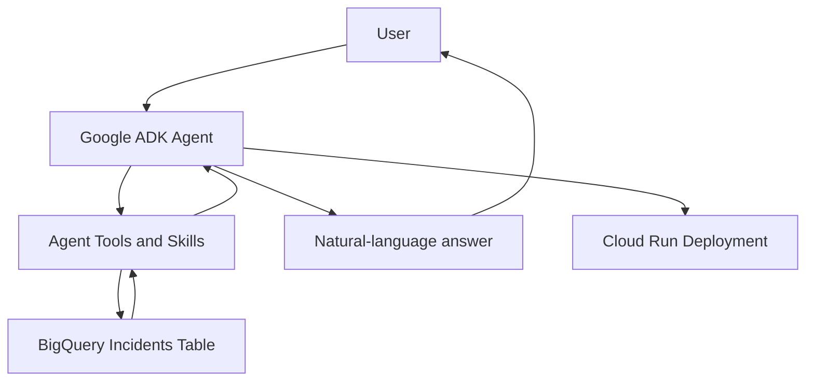

# ServiceNow Incident Analytics Agent

An AI-powered incident analytics assistant built with **Google Agent Development Kit (ADK)**, **Gemini**, and **BigQuery**. It answers natural-language questions about incident counts, aging, resolution times, status breakdowns, and assignment-group analysis.

> **Note:** This is a learning and demonstration project. Use synthetic or approved data, and review security, access controls, logging, and cost controls before using real production incident data.

## Key Features

- Natural-language questions over BigQuery incident data
- Open and closed incident counts
- Filtering by date range and assignment group when requested
- Mean time to resolve for closed incidents
- Average aging for open incidents
- Assignment-group analysis
- Google ADK agent architecture
- Cloud Run deployment
- Configuration through environment variables
- Separate development and production deployments

## Example Questions

- How many open incidents are there?
- How many incidents were closed in August 2026?
- What is the mean time to resolve for closed incidents?
- What is the average age of open incidents?
- Show open incidents by assignment group.
- Count incidents for the Cloud Infrastructure assignment group.
- Show incident details for a specific month.

The exact questions supported depend on the tools and instructions configured in the agent.

## Architecture Overview




### Components

1. **Agent layer**
   - Google Agent Development Kit (ADK)
   - Gemini model for interpreting questions and composing responses
   - Agent instructions, tools, and optional sub-agents or skills

2. **Data layer**
   - BigQuery stores incident records
   - SQL queries aggregate and filter incident data

3. **Deployment layer**
   - Cloud Run hosts the deployed ADK application
   - Google Cloud IAM controls access to cloud resources

## Data Model

The incident table used for the demonstration contains these fields:

| Column | Description |
|---|---|
| `incident_id` | Unique incident identifier |
| `opened_date` | Timestamp when the incident was opened |
| `closed_date` | Timestamp when the incident was closed; may be empty for open incidents |
| `status` | Incident status, such as New, In Progress, On Hold, or Closed |
| `assignment_group` | Team responsible for the incident |
| `assignee` | Person assigned to the incident |
| `category` | Incident category |
| `priority` | Incident priority |
| `short_description` | Short description of the incident |

Confirm the actual BigQuery schema and data types in your environment before running queries. In particular, ensure `closed_date` is stored as a timestamp or is safely converted to one in SQL.

## Technology Stack

- [Python](https://www.python.org/)
- [Google Agent Development Kit (ADK)](https://google.github.io/adk-docs/)
- [Gemini](https://ai.google.dev/gemini-api/docs)
- [Google Cloud Run](https://cloud.google.com/run)
- [Google BigQuery](https://cloud.google.com/bigquery)
- [Google Cloud IAM](https://cloud.google.com/iam)

## Repository Structure

The exact structure depends on how the agent is organized. A typical layout is:

```text
servicenow-incident-analytics-agent/
├── agent.py
├── requirements.txt
├── .env.example
├── .gitignore
├── README.md
├── sub_agents/
│   └── ...
└── skills/
    └── ...
```

Keep this section aligned with the actual files in your repository. Do not commit virtual environments, local ADK session data, API keys, or other credentials.

## Prerequisites

- A Google Cloud project with billing enabled
- BigQuery API and Cloud Run API enabled
- Python version supported by your installed ADK version
- Google Cloud CLI (`gcloud`)
- Google Cloud permissions to query the BigQuery table and deploy to Cloud Run

## Configuration

Configure the project and BigQuery table using environment variables. Adjust the names if your code uses different variables.

```bash
export GOOGLE_CLOUD_PROJECT="YOUR_PROJECT_ID"
export GOOGLE_CLOUD_LOCATION="global"
export GOOGLE_GENAI_USE_ENTERPRISE="1"

export BQ_PROJECT_ID="YOUR_PROJECT_ID"
export BQ_DATASET_ID="YOUR_DATASET"
export BQ_TABLE_ID="YOUR_TABLE"
```

For local development, authenticate with Application Default Credentials:

```bash
gcloud auth application-default login
gcloud config set project YOUR_PROJECT_ID
```

Do not put credentials in source code or commit `.env` files. For deployed services, prefer a dedicated service account with only the permissions the agent requires.

## Local Setup

### 1. Clone the repository

```bash
git clone https://github.com/YOUR_GITHUB_USERNAME/servicenow-incident-analytics-agent.git
cd servicenow-incident-analytics-agent
```

Replace the URL with your actual repository URL.

### 2. Create and activate a virtual environment

Linux or macOS:

```bash
python3 -m venv .venv
source .venv/bin/activate
```

Windows PowerShell:

```powershell
python -m venv .venv
.venv\\Scripts\\Activate.ps1
```

### 3. Install dependencies

```bash
python -m pip install --upgrade pip
pip install -r requirements.txt
```

### 4. Authenticate with Google Cloud

```bash
gcloud auth application-default login
gcloud config set project YOUR_PROJECT_ID
```

Ensure your identity has permission to query the BigQuery dataset.

### 5. Run the ADK development interface

From the directory expected by your ADK package structure, run:

```bash
adk web
```

Select your agent in the ADK development interface and test the example questions. The ADK web interface is intended for development and testing, not as a customer-facing production UI.

## BigQuery Access

Commonly required permissions include:

- **BigQuery Job User** at the project level, to run query jobs
- **BigQuery Data Viewer** on the relevant dataset or table, to read incident data

Grant only the minimum permissions required. Before using real incident data, verify that the agent returns only fields the user is authorized to see.

## Deploy to Cloud Run

The ADK CLI supports deploying an agent to Cloud Run. Run the command from the directory expected by your ADK project structure.

```bash
adk deploy cloud_run \
  --project=YOUR_PROJECT_ID \
  --region=YOUR_REGION \
  --service_name=servicenow-incident-agent \
  --with_ui \
  .
```

The `--with_ui` option includes the ADK development UI. It is useful for demonstrations and testing, but it is not a substitute for a purpose-built customer-facing web application.

For production deployments:

- Use a dedicated service account.
- Keep the service authenticated unless public access is explicitly required and approved.
- Configure environment variables deliberately.
- Review logs and error handling.
- Set appropriate scaling and budget alerts.
- Do not expose sensitive incident details to unauthorized users.

## Example Analytics

### Open incident count
Count records whose status is considered open according to your organization's definitions.

### Closed incident count
Count records with status `Closed`, optionally filtered by closing date or another requested period.

### Mean time to resolve
For closed incidents, calculate the elapsed time between `opened_date` and `closed_date`, then average the duration over the requested population.

### Average aging of open incidents
For open incidents, calculate elapsed time between `opened_date` and the current timestamp, then average the duration over the requested population.

Metric definitions matter. Confirm which statuses count as open, whether date filters apply to opened or closed dates, and whether aging/resolution time is measured in hours or days.

## Security and Cost Considerations

- Use synthetic data for demos whenever possible.
- Keep Cloud Run private or protected by appropriate authentication.
- Store credentials in approved secret-management services; never commit secrets.
- Use a dedicated service account with least-privilege permissions.
- Review BigQuery query patterns and monitor query costs.
- Configure Google Cloud budget alerts.
- Review logs to ensure sensitive incident content is not unnecessarily recorded.
- Do not rely on the language model alone to enforce authorization or data access restrictions.

## Troubleshooting

| Issue | Checks |
|---|---|
| BigQuery permission error | Confirm the active identity or Cloud Run service account has job and data access |
| Table not found | Verify project, dataset, table name, and region |
| Model not found | Confirm the model identifier is available for the configured API, project, and location |
| Missing environment variable | Verify variable names in local configuration and Cloud Run settings |
| Cloud Run returns 403 | Check authentication and `roles/run.invoker` access |
| ADK development UI fails | Check the agent package layout, dependencies, logs, and ADK version |

## Learning Outcomes

This project demonstrates practical experience with:

- Building an agent using Google ADK
- Connecting an agent to BigQuery
- Translating natural-language questions into analytics workflows
- Structuring an agent with tools, instructions, sub-agents, or skills
- Deploying an AI application to Cloud Run
- Applying IAM and least-privilege access
- Separating development tools from customer-facing production interfaces

## Future Enhancements

- Customer-facing React chat interface
- Authentication and user-specific authorization
- Charts and visual analytics
- Conversation history and session management
- Automated evaluation tests for common incident questions
- Monitoring, tracing, and response-quality evaluation
- CI/CD deployment pipeline

## Disclaimer

This repository is a technical demonstration and learning project. It is not an official ServiceNow product and should not be treated as a production-ready incident management system without additional testing, security review, monitoring, and operational controls.
